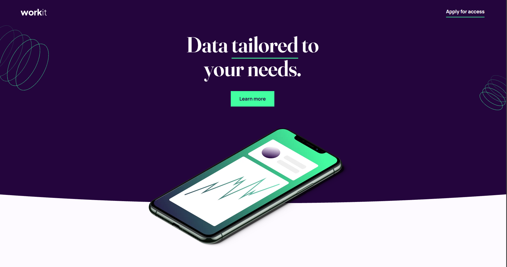

# Frontend Mentor - Workit landing page solution

This is a solution to the [Workit landing page challenge on Frontend Mentor](https://www.frontendmentor.io/challenges/workit-landing-page-2fYnyle5lu). Frontend Mentor challenges help you improve your coding skills by building realistic projects.

## Table of contents

- [Overview](#overview)
  - [The challenge](#the-challenge)
  - [Screenshot](#screenshot)
  - [Links](#links)
- [My process](#my-process)
  - [Built with](#built-with)
  - [What I learned & Key Challenges](#what-i-learned--key-challenges)
- [Project Estimation & Retrospective](#project-estimation--retrospective)
- [Author](#author)

## Overview

### The challenge

Users should be able to:
- View the optimal layout depending on their device's screen size.
- See a responsive landing page that shifts seamlessly between mobile, tablet (target), and desktop viewports.
- View a high-fidelity implementation with complex section overlaps and decorative background patterns.

### Screenshot

  
*Fig 1. Final responsive implementation of the Workit landing page challenge using semantic HTML5, BEM methodology, SASS/SCSS standalone blocks, CSS Grid, Flexbox, custom properties, and multiple media query layers.*

### Links

- Solution URL: [Solution Link](https://github.com/Osty-trainee/workit-landing-page)
- Live Site URL: [Live Site Link](https://osty-trainee.github.io/workit-landing-page/)

## My process

### Built with

- Semantic HTML5 markup (`header`, `main`, `section`, `footer`)
- BEM (Block-Element-Modifier) naming convention for clean SCSS structure
- SASS / SCSS layout architecture with variable design tokens
- Flexbox for mobile and tablet responsive grids
- Absolute positioning for intricate graphic overlaps
- Multiple CSS backgrounds for desktop decoration elements

## What I learned & Key Challenges

During this challenge, I faced several specific layout bugs across viewports and learned how to resolve them cleanly.

### 1. Eliminating the Sub-Pixel SVG Line Glitch
The biggest problem was a sharp pixel line (rounding error) that appeared right below the SVG curve on mobile devices. Standard scaling didn't help. 

By applying an absolute positioning analogy, matching the SVG path color to the native section background, and forcing a `-2px` bottom bleed, the glitch was completely erased:

```scss
.hero__curve {
  position: absolute;
  left: 0;
  bottom: -2px; // Pushes the curve down to cover the browser rendering gap
  display: block;
  width: 100%;
  height: 34px;
  z-index: 5;

  path {
    fill: var(--purple-100); // Matches the exact color of the next section
  }
}
```

### 2. Making the Hero Phone Image Intersect with the Curve
To make the phone image look like it's emerging from the curved section rather than just floating above it, I had to configure structural layer depths. Using negative margins allowed the image to perfectly cross the border line:

```scss
&__image-container {
  position: relative;
  z-index: 4; // Keeps the image right below the curve plane layer
  width: 100%;
  max-width: 20rem;
  margin-top: var(--spacing-600);
  margin-bottom: -120px; // Smoothly pulls the device image down over the curve boundary
}
```

### 3. Fixing the Asymmetric Avatar Distortion (The "Egg" Bug)
On desktop screens, the round founder avatar (`.founder__image-container`) accidentally compressed into an oval shape because the flexbox row layout compressed the image block to save space for the text container. 

To fix this, I completely removed the fluid width limits, forced a strict block size, and applied a `flex-shrink: 0` guard rule:

```scss
&__image-container {
  position: relative;
  width: 29.8125rem; // Fixed desktop width
  height: 29.8125rem; // Fixed desktop height to ensure a perfect 1:1 box ratio
  max-width: none; // Completely overrides mobile max-width restrictions
  flex-shrink: 0; // Prevents the flex container from squishing the circle into an oval
  border-radius: 50%;
  overflow: hidden;

  img {
    display: block;
    width: 100%;
    height: 100%; // Overrides mobile auto-height
    object-fit: cover; // Keeps the aspect ratio pristine
  }
}
```

## Project Estimation & Retrospective

- **Initial Estimation:** 4 to 5 hours.
- **Actual Time Taken:** ~10 hours.

**Retrospective Summary:**  
This project was an incredible deep dive into practical geometry fixes, asset layering, and layout stacking. Overcoming browser-specific SVG antialiasing gaps, item distortion under flex pressure, and managing clean SASS blocks significantly leveled up my fluid design workflow.

## Author

- GitHub - [@Osty-trainee](https://github.com/Osty-trainee)
- Frontend Mentor - [@Osty-trainee](https://www.frontendmentor.io/profile/Osty-trainee)
